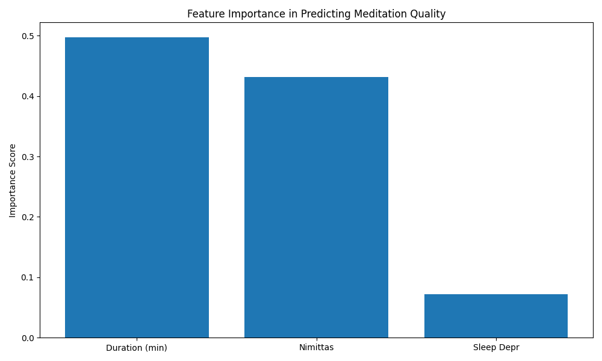
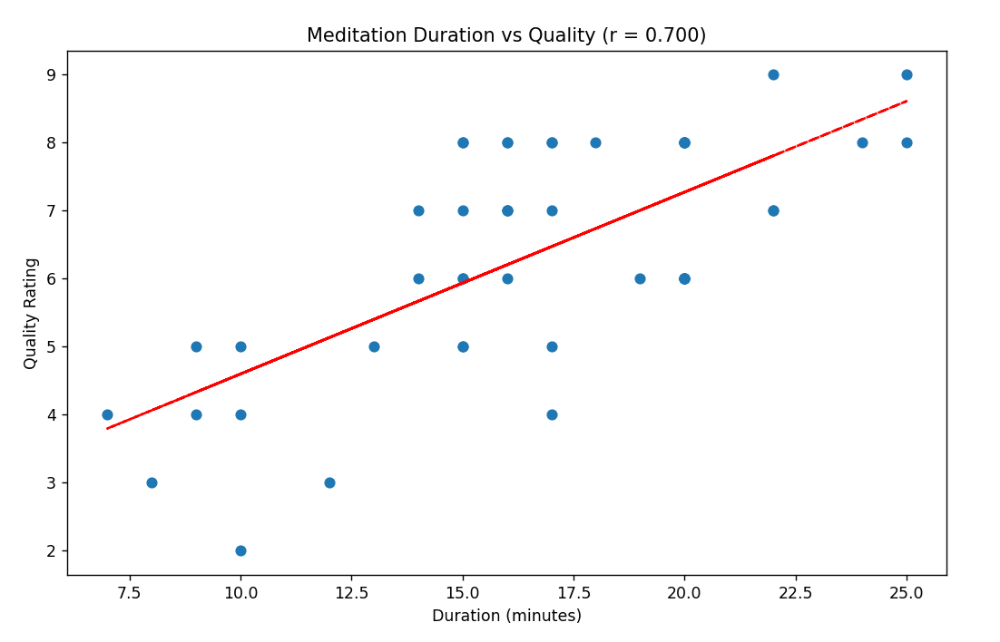
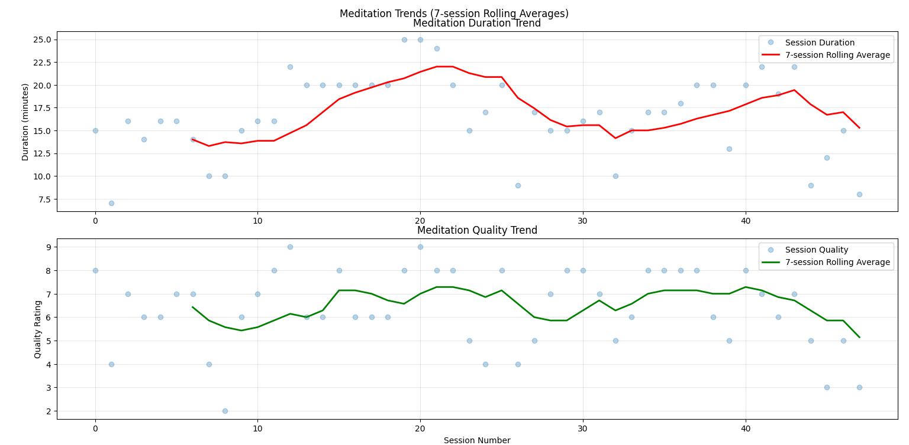

# Detailed Meditation Analysis 

## Introduction

This project demonstrates how modern analytical approaches can efficiently extract meaningful insights from meditation practice data. By combining AI-augmented analytics with traditional statistical methods, I was able to rapidly develop and test multiple analytical frameworks while maintaining rigorous standards for insight generation and validation.

The analysis focused on determining the factors that contribute to meditation session quality and the presence of nimittas, or visual phenomena that can appear during meditation when one is very focused and relaxed. Nimittas don't occur for every meditation practitioner, but I'm fortunate enough to be able to experience them and use them as an indicator of my meditation progress.

The comprehensive nature of this analysis was enabled by leveraging modern analytical tools and approaches, allowing for rapid iteration through different analytical methods while maintaining depth and accuracy. This approach facilitated the exploration of various visualization techniques and statistical models, resulting in a richer understanding of the meditation practice data.

The dataset consisted of 47 meditation sessions between August and October of 2024. It included a variety of variables, such as session date, start time, duration, sleep deprivation, and presence of nimittas. While traditional analysis might have required weeks of coding and debugging, modern analytical approaches allowed for rapid development of the database schema, analysis frameworks, and visualization tools, enabling a focus on insight generation rather than technical implementation.

Through this efficient approach, I was able to implement:
- Multiple visualization techniques for different aspects of the data
- Statistical analysis including correlation studies and feature importance
- Interactive dashboard development
- Machine learning for predictive factor analysis

The following sections provide an in-depth examination of the findings, demonstrating how this modern analytical approach can deliver sophisticated insights while maintaining analytical rigor.

## Tools and Libraries Used 
- Data Analysis: Python, Pandas, Scikit-learn 
- Data Visualization: Matplotlib, Plotly 
- Dashboard Creation: Streamlit

## Dataset Statistics
Average session length: 16.6 minutes

Quality rating distribution:
- Rating 2: 1 session (2.1%)
- Rating 3: 2 sessions (4.2%)
- Rating 4: 4 sessions (8.3%)
- Rating 5: 6 sessions (12.5%)
- Rating 6: 11 sessions (22.9%)
- Rating 7: 8 sessions (16.7%)
- Rating 8: 14 sessions (29.2%)
- Rating 9: 2 sessions (4.2%)

Sessions with nimittas: 75.0%

## Challenges

There were two primary challenges: 

1. The limited dataset.
Even though 47 sessions was enough to get a rough picture of the notable factors that contributed to high quality meditation sessions, a dataset of double or triple this size would have led to more statistically significant conclusions. 

2. Potential Confounding Variable. 
During this analysis, I realized that my lower duration sessions were often a result of me starting with a lower level of focus initially due to laxity (being too relaxed to the point of sleepiness), etc, and ending the session around the 10 minute mark. Therefore this initial focus level could be considered a confounding variable, influencing both the independent variable (duration) and independent variable (quality rating). In the future, it would be beneficial to note the initial focus for each session and track the factors that might contribute to it, such as hours of sleep the night before, caffeine intake, anxiety level, disruption level. In addition it would be good to experiment with and track the influence of premeditation routines such as stretching and bodyscanning, which are sometimes recommended by meditation instructors.

## Key Insights

Despite the limited dataset and potential confounding variable, I was able to draw some useful insights from the analysis:

1. All sessions in which sleep deprivation was a factor resulted in a low rating.
2. Nimittas were present more often during longer meditation sessions, with the median around 17.5 minutes.
3. There were no sessions of 20 minutes or longer that didn't include nimittas.
4. High-quality sessions were clustered in the 11 am to 1 pm range and most heavily around 11:45 am.

## Broader Implications

### Personal
I should only meditate after adequate sleep, beginning the session between 11 am to 1 pm if possible, and aiming for at least 20 minutes. Following these principles will almost certainly lead to meditation sessions with nimittas and thus, a higher than average rating.

### Business
Meditation apps should allow people to rate their meditation sessions, track the start time, duration, and allow the user to choose from a variety of characteristics associated with the session, such as nimittas, distraction, sleep deprivation, and even choose their own characteristics to track. By doing so, the app could make suggestions to optimize the user's meditation practice.

## Feature Importance Analysis

In this analysis 100 decision trees received randomized sets of data from the 80% of the data which was set aside for training. A decision tree might examine a session and ask, "Did this session have nimittas present?" Yes. Did this receive a rating higher than 7? Yes. Therefore nimittas in a sense gets a point in predictive value. Each tree looks at numerous sessions, comparing different features. The selection of sessions given to each tree, known as bootstrapping, might include some sessions multiple times, and some sessions zero times. After the training period, 20% of the data set was used for testing, allowing the trees to use the features to predict the outcome. The importance value of each feature is determined by how effective the feature is in allowing the decision trees to predict the quality rating. 

The key insight is that meditation session duration was the feature most able to predict whether the session would receive a high rating, and this confirms the conclusion from other charts. However, the presence of nimittas was also valuable. I found it interesting that sleep deprivation received such a low score, because I know from experience that this always resulted in me giving the session a low rating. However, this feature very likely had little predictive value, because it was only associated with low ratings, meaning its presence didn't necessarily predict sessions with higher ratings. Also, there were very few sessions in which I was sleep deprived. If this feature had been represented more frequently in the dataset, I think its predictive value would have been higher, but still not as high as the other two variables.

## Quality vs Duration Analysis

This is a Matplotlib scatter plot with correlation coefficient showing the relationship between the duration of meditation sessions and the quality rating 1-10 I gave to each session. 

I chose this chart because it shows the aforementioned relationship at a glance, making it easy for non-technical people to draw insights from the data. The inclusion of the correlation coefficient, although a more technical concept than the trend line, confirms the trend line direction and provides a more exact metric. This type of chart will appeal to those with visual and/or numerical preferences. 

The primary insight visible from this chart is that there's a strong positive correlation (r = 0.70) between meditation duration and session quality. The implications for my own practice are that I need to give myself sufficient time to meditate, and if I'm pressed for time and have less than 10 minutes to devote to it, it's best to wait for a longer window of opportunity. 

As a follow-up to this analysis, it would be valuable to collect data that includes much longer meditation session times, such as 30 and 40 minute sessions to see if the correlation stays the same or decreases.

## Nimittas and Session Duration Analysis

This is a box plot showing the relationship between meditation session duration and the presence of nimittas. For those who might not be familiar with the term, nimittas are visual phenomena that can appear during meditation while one is very focused and relaxed. They don't occur for every meditation practitioner, but I'm fortunate enough to be able to experience them and use them as an indicator of my meditation progress. 

I chose the box plot because it's ideal for boolean variables (yes/no), such as the question of whether nimittas were present. We see two box plots displayed, one in which nimittas were not present and one in which they were. If you look at a box plot, you'll notice 5 horizontal lines. These lines represent 4 sections, each containing 25% of the data. The orange horizontal line represents the median number. 

At a glance, we can see that nimittas were present more often during longer meditation sessions, with the median around 17.5 minutes. The median of the non-nimitta sessions was around 10 minutes. There were 17 minute sessions that didn't include nimittas, so sessions of this length were not a guarantee of the presence of nimittas. However, there were no sessions of 20 minutes or longer that didn't include nimittas. In the future it would be worth looking at a larger data set of only 20 minute+ sessions to see if this pattern holds true. 

However, one thing the data doesn't reveal is that if I was not feeling extremely focused to begin with in my session, I sometimes stopped the session around the 10 minute mark. It's likely that forcing myself to continue meditating past the 20 minute mark despite this less optimal state wouldn't have produced nimittas. Therefore, in this case we would consider initial focus a potential confounding variable, since it may have affected the independent variable (duration) and the dependent variable (presence of nimittas).

## Time of Day Analysis

This is a Plotly bubble chart that shows the time my meditation sessions started, the duration of the sessions, and the quality rating I gave to each session as indicated by the size and color of the bubble. 

I chose this chart because it shows the relationships between three variables. A trend line on a scatter plot might provide a quick intuitive understanding with just two variables, but a couple minutes studying the box plot provides more information with that extra variable. 

In addition, when this chart is displayed in its interactive form, it also shows a 4th variable--the presence of nimittas. One can see this data in an information box upon hovering over the bubbles. 

We can see that the high-quality sessions are clustered in the 11 am to 1 pm range, and most heavily around 11:45 am. In addition, the fact that these bigger green and yellow bubbles are on the right shows, like my other charts, that longer sessions typically received higher ratings. 

The primary insight is that in my meditation practice I should prioritize beginning my sessions between 11 am and 1 pm, aiming for a duration of at least 15 minutes, and ideally 20 minutes.

## Practice Trends Analysis

This is a set of Matplotlib rolling average charts, one showing meditation session durations over time, and the other showing session quality rating over time. The points on the trend lines are determined by taking the average of the current session along with the previous 6 sessions (7-period moving averages). 

The reason I chose this chart is because it shows a smoother line than would be the case if we created a line between all data points without calculating the averages. The 7-period in particular provides a nice balance, reducing noise while maintaining key visual information. 

We can see at a glance the correlation between session duration and quality rating (r = .70 as discussed in the scatter plot). However, during the two periods of maximum duration, the ratings seemed to plateau around the 7 range. 

This indicates that while increased duration contributed to higher ratings, there was a limit to this effect. Therefore it's reasonable to assume that even longer periods of meditation, such as 30 or 40 minutes would offer diminishing returns. However, that doesn't negate the value of gathering the necessary data to confirm this.

## Streak Analysis

This is a chart showing the relationship between the quality rating of meditation sessions and the number of days meditated in a row (streak). 

I chose to study streaks because many meditation apps emphasize streak maintenance, aligning with the common belief that consistency improves quality. I wanted to draw my own statistical conclusions about its degree of importance. 

This scatter plot reveals a surprising negative correlation (r = -0.363) between streak length and meditation quality. While conventional wisdom might suggest that consistent practice leads to better sessions, the downward-sloping trend line suggests otherwise. However, this finding should be interpreted cautiously given the limited dataset. Several factors could explain this unexpected relationship: perhaps longer streaks coincided with busier periods when sessions were shorter, or maybe the pressure to maintain a streak led to sessions at less optimal times.

Even though this chart doesn't show a conclusive correlation, I consider this analysis a success because it both satisfied my curiosity to a degree and redirected me toward those variables that were more meaningful in comparison, such as duration, presence of nimittas, etc. Having said that, I would like to study these variables with a larger dataset in the future to see if more conclusive insights can be gained.

## Limitations and Future Opportunities

There were two primary challenges: 

1. The limited dataset.
Even though 47 sessions was enough to get a rough picture of the notable factors that contributed to high quality meditation sessions, a dataset of double or triple this size would have led to more statistically significant conclusions. 

2. Potential Confounding Variables
During this analysis, I realized that my lower duration sessions were often a result of me starting with a lower level of focus initially due to laxity (being too relaxed to the point of sleepiness), etc, and ending the session around the 10 minute mark. Therefore this initial focus level could be considered a confounding variable, influencing both the independent variable (duration) and dependent variable (quality rating). In the future, it would be beneficial to note the initial focus for each session and track the factors that might contribute to it, such as hours of sleep the night before, caffeine intake, anxiety level, disruption level. In addition it would be good to experiment with and track the influence of premeditation routines such as stretching and bodyscanning, which are sometimes recommended by meditation instructors.

### Future Research Opportunities
1. Track additional variables:
   - Initial focus level
   - Hours of sleep
   - Caffeine intake
   - Environmental disruption level
2. Study impact of pre-meditation routines
3. Analyze longer sessions (30-40 minutes)
4. Gather larger dataset for streak impact analysis
5. Investigate the relationship between time of day and initial focus level

## Contact
For collaboration opportunities, reach out via symmetry1@live.com

© 2024 Heath Hoppus
