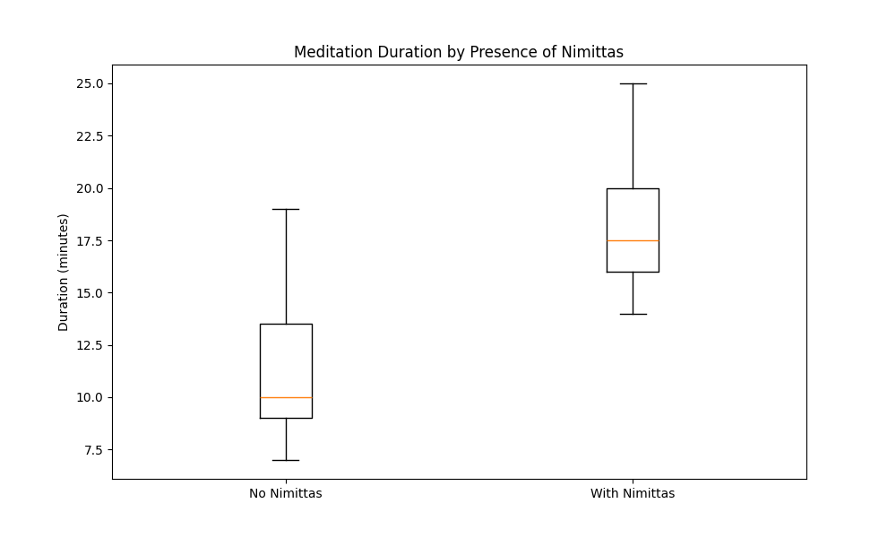

# Meditation Session Analysis Project

## Overview
An innovative analysis of meditation session data using AI-augmented analytics to identify key factors contributing to session quality and the presence of nimittas (visual meditation phenomena). This project demonstrates how modern analytical approaches can transform personal wellness data into actionable insights, with potential applications for meditation apps and wellness platforms.

## Project Approach
This project showcases the power of combining traditional analytical thinking with AI-augmented development to:
- Design and implement comprehensive database schemas
- Conduct statistical analysis using multiple approaches
- Create sophisticated visualizations
- Build interactive dashboards
- Extract actionable insights from complex data

The efficiency of this approach allowed for rapid iteration and testing of different analytical methods, resulting in a more comprehensive analysis than traditional approaches might allow.

## Key Insights
1. **Optimal Session Timing**
   - High-quality sessions clustered between 11 AM and 1 PM
   - Peak performance around 11:45 AM
   - Sessions under 10 minutes showed limited benefit

2. **Nimittas Analysis**
   - Sessions ≥20 minutes consistently produced nimittas
   - Median duration for sessions with nimittas was 17.5 minutes
   - 75% of sessions with nimittas occurred during optimal time window
   - Strong predictor of session quality

3. **Critical Factors**
   - Session duration most strongly predicts quality
   - Time of day more important than maintaining daily streaks
   - Sleep quality significantly impacts effectiveness

## Business Applications
- **Meditation App Enhancement**
  - Implement personalized timing recommendations
  - Track advanced metrics like nimittas for experienced users
  - Develop adaptive session duration suggestions
  - Create custom tracking features for specialized practice goals

- **Wellness Platform Integration**
  - Incorporate sleep quality monitoring
  - Develop quality-based achievement systems
  - Enable custom metric tracking for individual practice goals

## Visualizations

### Quality vs Duration Analysis


*Strong correlation (r = 0.70) between session duration and quality ratings suggests clear duration recommendations could improve user experience. Trend analysis shows diminishing returns after certain thresholds, enabling optimized session length suggestions.*

### Nimittas and Session Duration


*Box plot analysis reveals the relationship between session duration and nimittas presence. Sessions ≥20 minutes consistently produced nimittas, while shorter sessions rarely did. This type of analysis can help meditation apps develop targeted duration recommendations for users seeking deeper states of meditation.*

### Feature Importance Analysis


*Random Forest machine learning analysis quantified which factors best predict session quality. This analysis can help meditation apps prioritize which metrics to track and how to make automated recommendations.*

### Time-of-Day Impact


*Multi-dimensional analysis revealing optimal meditation times and their relationship with session quality and duration. Shows clear patterns that could inform personalized scheduling recommendations.*

### Practice Trends


*Seven-session rolling averages demonstrating the relationship between consistent practice and session quality. Reveals patterns that could inform user engagement strategies.*

## Dataset Overview
- 47 meditation sessions
- August-October 2024
- Variables tracked:
  - Session duration
  - Quality rating (1-10)
  - Presence of nimittas
  - Sleep quality
  - Time of day

## Technical Implementation
This project demonstrates modern analytical capabilities through:
- Efficient data manipulation with Python and SQL
- Advanced statistical analysis
- Multiple visualization approaches
- Interactive dashboard development
- Machine learning for feature importance analysis

Implementation code is available in the `src` directory for review. This code is provided to demonstrate technical approach and is not configured for external execution due to private data dependencies.

For detailed analysis methodology and findings, see `ANALYSIS.md`.

## Project Structure
```
meditation_analysis/
├── README.md
├── ANALYSIS.md
├── .gitignore
├── .env
├── requirements.txt
├── images/
│   └── [visualization images]
└── src/
    └── [python files]
```

## Contact
For collaboration opportunities, please reach out via symmetry1@live.com

© 2024 Heath Hoppus